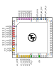

<!---

This 
-->
# Systolic Array with DFT
## Multiply and accumulate matrix multiplier ASIC with DFT(design-for-test) infrastructure

The design is orginially forked from https://github.com/Essenceia/Systolic_MAC_with_DFT

It is an ASIC design for a 2x2 systolic matrix multiplier supporting multiply and accumulate
operations on int8 data alongside a design for test infrastructure to help debug
both usage and diagnose design issues in silicon.

# Pinout 

This accelerator uses the following pinout:

| ui (Inputs)       | uo (Outputs)     | uio (Bidirectional)      |
| ----------------- | ---------------- | ------------------------ |
| ui[0] = tck       | uo[0] = result_o | uio[0] = data_i[7]       |
| ui[1] = data_i[0] | uo[1] = result_o | uio[1] = data_valid_i    |
| ui[2] = data_i[1] | uo[2] = result_o | uio[2] = data_mode_i     |
| ui[3] = data_i[2] | uo[3] = result_o | uio[3] = data_rst_addr_i |
| ui[4] = data_i[3] | uo[4] = result_o | uio[4] = tdi             |
| ui[5] = data_i[4] | uo[5] = result_o | uio[5] = tms             |
| ui[6] = data_i[5] | uo[6] = result_o | uio[6] = tdo             |
| ui[7] = data_i[6] | uo[7] = result_o | uio[7] = result_v_o      |
 
 

# MAC 

This MAC accelerator operates at up to 50MHz and is capable of reaching up to 100 MMAC/s or 200 MIOPS/s. 

## Background 

The goal of the MAC accelerator is to perform a matrix matrix multiplication between the input data
matrix $I$ and the weight matrix $W$. 
```math
\begin{gather}
I \times W = R \\
\begin{pmatrix} 
i_{0,0} & i_{1,0} \\
 i_{0,1} & i_{1,1} 
\end{pmatrix} 

\times 

\begin{pmatrix} 
w_{0,0} & w_{1,0} \\ 
w_{0,1} & w_{1,1} 
\end{pmatrix} = 

\begin{pmatrix} 
i_{0,0}w_{0,0}+i_{1,0}w_{0,1} & i_{0,0}w_{1,0}+i_{1,0}w_{1,1}\\ 
i_{0,1}w_{0,0}+i_{1,1}w_{0,1} & i_{0,1}w_{1,0}+i_{1,1}w_{1,1}\end{pmatrix}

=

\begin{pmatrix} 
r_{0,0} & r_{1,0} \\ 
r_{0,1} & r_{1,1} 
\end{pmatrix}
\end{gather}

```
This MAC accelerator has 4 units and from this point on, we will refer to each MAC unit according to their unique $(x,y)$ coordinates. 

Each MAC unit calculates the MAC operation $c_{(t,x,y)}$, where :
- $w_{(x,y)}$ is the fixed weight configured for this unit; this value is fixed throughout a set of $I$ and $W$ input matrices.
- $i_{(t,y)}$ is a value from the $y$ row of the $I$ matrix that is circulated per timestep $t$ through a row of the matrix.
- $c_{(t-1,x,y-1)}$ is the result at the previous timestep $t-1$ of the MAC unit above this MAC unit, circulated downwards per column.
```math
c_{(t,x,y)} = i_{(t,y)} \times w_{(x,y)} + c_{(t-1,x,y-1)}
```

Given this accelerator was designed to operate on signed 8-bit integers, 
but that the successive application of the 8-bit multiplication and addition 
pushes the resulting value up to 17 bits, in order to prevent the size of the base datatype 
from increasing with each successive MAC operation, we need to clamp it down back within the 8-bit range.

As such, the MAC unit performs an additional clamping function $clamp_{i8}$ that remaps :
```math
clamp_{i8}(c_{(t,x,y)}) = \begin{cases}
   127 &\text{if } c_{(t,x,y}) > 127\\
   c_{(t,x,y)} &\text{if } c_{(t,x,y)} \in [-128,127] \\
    -128 &\text{if } c_{(t,x,y}) < -128\\
\end{cases}
```

Our final full MAC operation is as follows : 
```math
c_{(t,x,y)} = clamp_{i8}(i_{(t,y)} \times w_{(x,y)} + c_{(t-1,x,y-1)})
```

At each MAC timestep $t+1$ :
- the result of a MAC unit $c_{(t,x,y)}$ is shifted downwards on the same column and becomes the input of the MAC unit $(x,y+1)$ below.
- $i_{(t,x)}$ is shifted rightwards and used as input to MAC unit $(x+1,y)$. 

This data streaming allows such designs to make more efficient use of data, re-using it multiple times as the data circulates through the array, contributing to the final results without spending time on expensive data accesses, allowing us to dedicate more of our silicon area and cycles to compute.

## Throughput

Assuming a pre-configured $W$ weight matrix is being reused and the accelerator is receiving a gapless stream of multiple $I$ input matrices, this MAC accelerator is capable of computing up to 100 MMAC/s or 200 MIOPS/s.

### IO Bottleneck

Accelerator operations are stalled if a MAC operation has a data dependency on data that has yet to arrive. For example, calculating $r_{(0,0)}$ depends on both $i_{(0,0)}$​ and $i_{(1,0)}$​.
In practice, each operation depends on two pieces of input data, yet our input interface being only 8 bits wide allows us to transfer only a single $i_{(x,y)}$​ per cycle.

This limitation means our accelerator is actually operating at half maximum capacity due to this IO bottleneck. If the IO interface were either (a) at least 16 bits wide, or (b) 8 bits wide but operating at 100 MHz, resolving this bottleneck, our maximum throughput would be 200 MMAC/s or 400 MIOPS/s.

## Usage 

The typical sequence to offload matrix operations to the accelerator would go as follows:
1. Reset the accelerator (necessary on init)
2. Configure the weights $W$ (can be re-used once configured)
3. Send the input data $I$
4. Read the result $R$

This design doesn't feature on-chip SRAM and has limited on-chip memory.
Given weights have high spatial and temporal locality, this design allows each weight to be configured per MAC unit. This configuration can be reused across multiple matrices.
The input matrix, on the other hand, is expected to be provided on each usage.
